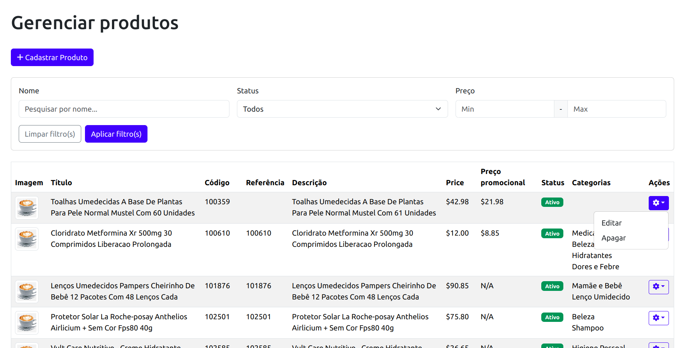

### Aplicação de Gerenciamento de Produtos

Este é um aplicativo web para gerenciamento de produtos. Ele permite que os usuários criem, visualizem, editem e excluam produtos de forma eficiente. O projeto foi desenvolvido utilizando **Angular 18** e **Bootstrap** para o design responsivo.

---

## Funcionalidades

- **Gerenciamento de Produtos**:
  - Adicionar novos produtos com informações detalhadas.
  - Atualizar produtos existentes.
  - Excluir produtos da lista.
- **Pesquisa e Filtro**:
  - Pesquisar produtos por nome.
  - Filtrar produtos por status (ativo/inativo) e faixa de preço.
- **Design Responsivo**:
  - Interface completamente adaptável para desktop e dispositivos móveis.
- **Categorias**:
  - Associar produtos a categorias para melhor organização.

---

## Estrutura de Pastas

```plaintext
src/
├── app/
│   ├── components/           # Componentes reutilizáveis
│   │   ├── confirm-delete-product/  # Componente para confirmar exclusão
│   │   ├── create-product/         # Componente para criar produtos
│   │   ├── product-table/          # Componente para exibir produtos em tabela
│   ├── pages/               # Componentes de página
│   │   ├── product/         # Página principal de gerenciamento de produtos
│   ├── services/            # Serviços para interação com APIs
│   │   ├── products/        # Serviço de produtos
│   ├── shared/
│   │   ├── models/          # Interfaces para Product e Category
│   │   ├── utils/           # Funções auxiliares
│   ├── app.component.*      # Componente raiz do Angular
│   ├── app.routes.ts        # Rotas da aplicação
├── assets/                  # Recursos estáticos
├── environments/            # Configurações específicas para ambientes
```

---

## Configuração e Instalação

### Pré-requisitos

- **Node.js** (v16 ou superior)
- **Angular CLI** (v15 ou superior)

### Instalação

1. Clone o repositório:
   ```bash
   git clone https://github.com/seu-repositorio/product-management.git
   ```

2. Navegue até o diretório do projeto:
   ```bash
   cd product-management
   ```

3. Instale as dependências:
   ```bash
   npm install
   ```

4. Execute a aplicação:
   ```bash
   ng serve
   ```

5. Abra a aplicação no navegador:
   ```plaintext
   http://localhost:4200
   ```

---

## Como Utilizar

### Adicionar um Produto
1. Clique no botão **"Cadastrar Produto"**.
2. Preencha o formulário no modal e clique em **"Salvar"**.

### Editar um Produto
1. Clique no ícone de engrenagem na coluna **"Ações"** e selecione **"Editar"**.
2. Atualize as informações do produto e clique em **"Salvar"**.

### Excluir um Produto
1. Clique no ícone de engrenagem na coluna **"Ações"** e selecione **"Apagar"**.
2. Confirme a exclusão no modal de confirmação.

### Filtrar Produtos
1. Utilize os filtros no topo da página para pesquisar por nome, filtrar por status ou definir uma faixa de preço.
2. Clique em **"Aplicar filtro(s)"** para visualizar os resultados filtrados.

---

## Tecnologias Utilizadas

- **Angular 18**: Framework frontend.
- **Bootstrap 5**: Estilo responsivo.
- **TypeScript**: Desenvolvimento com tipagem estática.
- **RxJS**: Programação reativa para lidar com chamadas de API.
- **SCSS**: Personalização de estilos.

---

## Integração com API

A aplicação interage com uma API backend para buscar, criar, atualizar e excluir produtos. Certifique-se de configurar corretamente o endpoint da API no arquivo `products.service.ts`.

```typescript
private apiUrl = 'http://localhost:3000/products';
```

---

## Capturas de Tela

### Dashboard


---